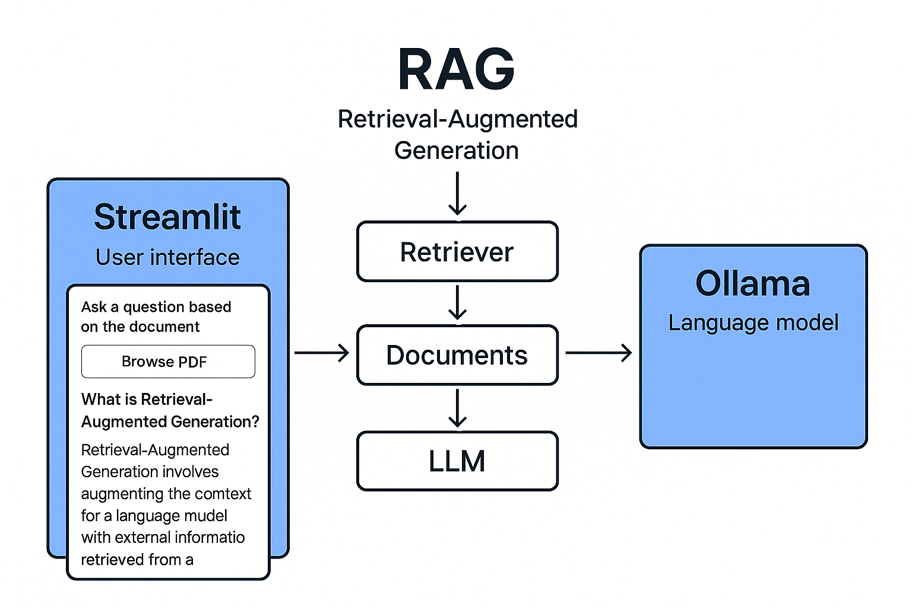
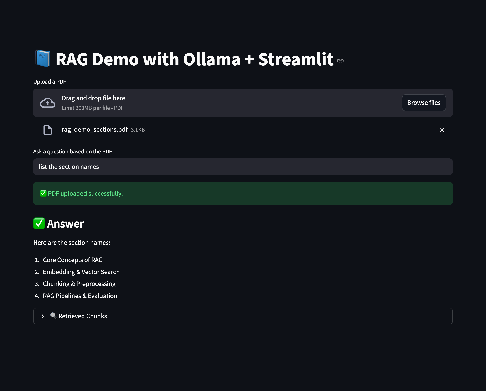

# rag-pipeline-tester

A lightweight framework for testing Retrieval-Augmented Generation (RAG) pipelines using PDF documents, embeddings, vector search, and local LLMs via Ollama.  
This project includes both a console-based tester and a Streamlit UI that allows uploading PDFs, viewing retrieved chunks, and verifying whether LLM answers are properly grounded.

---

## 📸 Screenshot

RAG test set up 

Preview of the Streamlit RAG Testing Dashboard:


---

## 🚀 Features
- PDF ingestion and text chunking  
- Vector embeddings using `mxbai-embed-large` (Ollama)  
- Local LLM inference (Llama 3.1 or any Ollama-supported model)  
- Retrieval inspection to verify grounding  
- Console-based RAG testing (`rag_demo.py`)  
- Streamlit UI for PDF upload and retrieval visualization (`streamlit_app.py`)  
- Supports multiple PDFs and dynamic testing  
- Grounded prompting to reduce hallucinations  

---

## ✅ Installation & Setup

### **1. Activate the virtual environment**
Run:

```bash
source activate_env.sh
```

You should see:

```
(.rag_env)
```

### **2. Install dependencies & set up environment**
Run:

```bash
bash setup.sh
```

This will:
- Install Python dependencies  
- Install LangChain packages  
- Install Ollama models  
- Verify the RAG setup  

---

## ▶️ Running the Console RAG Tester
```bash
python rag_demo.py
```

This will:
- Load your PDF  
- Create embeddings  
- Retrieve relevant chunks  
- Generate a grounded answer from the local LLM  

---

## ▶️ Running the Streamlit RAG App
```bash
streamlit run streamlit_app.py
```

Then open in your browser:

👉 http://localhost:8501

---

## 🧩 Project Structure
```
rag-pipeline-tester/
│
├── rag_demo.py
├── streamlit_app.py
├── setup.sh
├── activate_env.sh
├── screenshot/
│   └── image1.png
├── rag_test.pdf
├── rag_study.pdf
└── README.md
```

---

## 🧪 What This Project Demonstrates
- How a simple RAG pipeline works end-to-end  
- How QA engineers can validate RAG retrieval and grounding  
- How Streamlit improves clarity and repeatability  
- How local LLM setups using Ollama can be tested  

---

## 📌 Ideal For
- QA engineers validating LLM/RAG workflows  
- Developers exploring retrieval-augmented systems  
- Teams testing grounding quality  
- Anyone building local RAG prototypes  

---

## ⭐ Contributions
PRs are welcome!  

---

## 📜 License
MIT License
